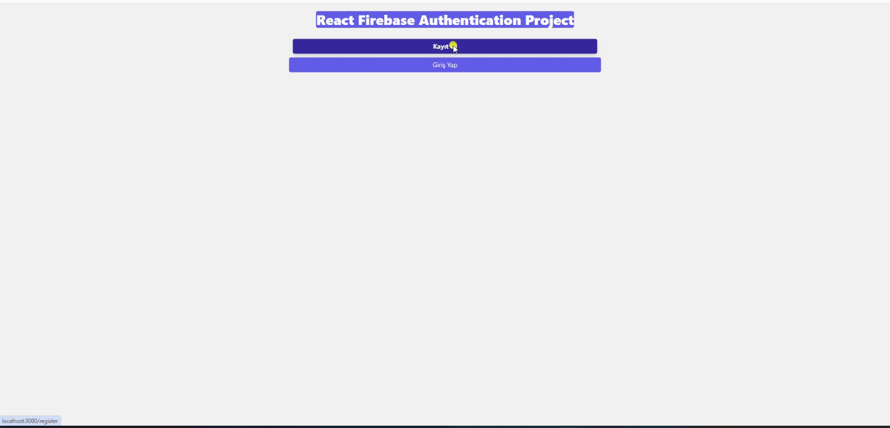
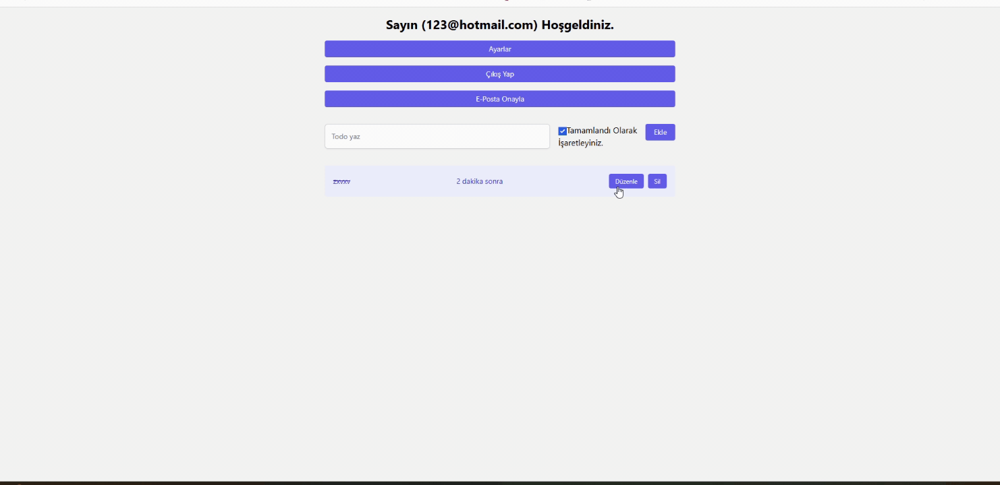

# React Firebase Authentication

# İşlemler

- Firebase Firestore kullanarak;
- Kullanıcı oluşturma, gücelleme
- Log-in/Log-out işlemleri,
- Veritabanı Oluşturma, veri kadetme, güncelleme ve silme
- Veritabanı güvenlik kuralları oluşturma,
- Zaman Formatlama,

# Kütüphaneler

- react-router-dom
- firebase
- react-hot-toast
- -D tailwindcss
- tailwindcss init
- tailwindui
- @tailwindcss/forms
- @reduxjs/toolkit
- react-redux
- @headlessui/react
- @formkit/auto-animate
- dayjs

# Ekran görüntüsü

# 

# 
